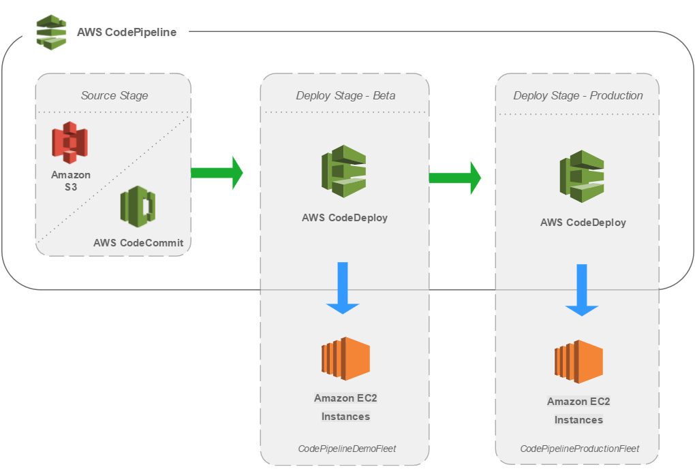

# Docker Container E-Commerce Application CI/CD Pipeline

This project sets up a complete CI/CD pipeline for a containerized e-commerce application using GitHub, AWS CodeBuild, CodeDeploy, CodePipeline, Amazon ECR, and Amazon ECS.

## Architecture Overview



The pipeline consists of the following stages:

1. **Source Stage**: Code is stored in GitHub and changes trigger the pipeline
2. **Build Stage**: AWS CodeBuild builds the Docker image and pushes it to Amazon ECR
3. **Test Stage**: Automated tests are run on the built container
4. **Deploy Stage**: AWS CodeDeploy deploys the container to Amazon ECS using blue/green deployment

## Prerequisites

- AWS Account
- GitHub Account
- AWS CLI configured with appropriate permissions
- Docker installed locally (for testing)

## Setup Instructions

### 1. Create the ECR Repository and ECS Infrastructure

```bash
# Create a VPC if you don't have one already
aws cloudformation create-stack \
  --stack-name ecommerce-vpc \
  --template-body file://vpc.yaml \
  --capabilities CAPABILITY_IAM

# Wait for the VPC stack to complete
aws cloudformation wait stack-create-complete --stack-name ecommerce-vpc

# Get VPC and Subnet IDs
VPC_ID=$(aws cloudformation describe-stacks --stack-name ecommerce-vpc --query "Stacks[0].Outputs[?OutputKey=='VpcId'].OutputValue" --output text)
SUBNET_IDS=$(aws cloudformation describe-stacks --stack-name ecommerce-vpc --query "Stacks[0].Outputs[?OutputKey=='PublicSubnets'].OutputValue" --output text)

# Create the ECS infrastructure
aws cloudformation create-stack \
  --stack-name ecommerce-ecs \
  --template-body file://ecs-infrastructure.yaml \
  --parameters \
    ParameterKey=VpcId,ParameterValue=$VPC_ID \
    ParameterKey=SubnetIds,ParameterValue=\"$SUBNET_IDS\" \
    ParameterKey=ECRRepositoryName,ParameterValue=ecommerce-app \
  --capabilities CAPABILITY_IAM

# Wait for the ECS stack to complete
aws cloudformation wait stack-create-complete --stack-name ecommerce-ecs
```

### 2. Create a GitHub Personal Access Token

1. Go to GitHub Settings > Developer settings > Personal access tokens
2. Generate a new token with `repo` and `admin:repo_hook` permissions
3. Copy the token for use in the next step

### 3. Create the CI/CD Pipeline

```bash
# Create the CI/CD pipeline
aws cloudformation create-stack \
  --stack-name ecommerce-pipeline \
  --template-body file://cicd-pipeline.yaml \
  --parameters \
    ParameterKey=GitHubOwner,ParameterValue=YOUR_GITHUB_USERNAME \
    ParameterKey=GitHubRepo,ParameterValue=YOUR_REPO_NAME \
    ParameterKey=GitHubBranch,ParameterValue=main \
    ParameterKey=GitHubToken,ParameterValue=YOUR_GITHUB_TOKEN \
    ParameterKey=ECSStackName,ParameterValue=ecommerce-ecs \
    ParameterKey=ECRRepositoryName,ParameterValue=ecommerce-app \
  --capabilities CAPABILITY_IAM

# Wait for the pipeline stack to complete
aws cloudformation wait stack-create-complete --stack-name ecommerce-pipeline
```

### 4. Push Your Code to GitHub

1. Initialize your repository:
   ```bash
   git init
   git add .
   git commit -m "Initial commit"
   git branch -M main
   git remote add origin https://github.com/YOUR_GITHUB_USERNAME/YOUR_REPO_NAME.git
   git push -u origin main
   ```

2. This will trigger the pipeline automatically.

## Pipeline Workflow

1. **Source Stage**:
   - Pipeline is triggered when code is pushed to the GitHub repository
   - CodePipeline pulls the source code

2. **Build Stage**:
   - CodeBuild uses the buildspec.yml to:
     - Run tests
     - Build the Docker image
     - Push the image to ECR
     - Generate artifacts for deployment

3. **Deploy Stage**:
   - CodeDeploy performs a blue/green deployment to ECS
   - New version is deployed to a new task set (green)
   - Traffic is gradually shifted from old (blue) to new (green)
   - Old task set is terminated after successful deployment

## Customizing the Application

### Dockerfile

The Dockerfile is set up for a Node.js application with an Nginx web server. Modify it according to your application's requirements.

### buildspec.yml

The buildspec.yml file defines the build process. Customize the test commands and other build steps as needed.

### appspec.yaml

The appspec.yaml file defines how CodeDeploy should deploy your application. Update the container name and other settings as needed.

## Monitoring and Troubleshooting

- **CloudWatch Logs**: All ECS tasks send logs to CloudWatch
- **CodePipeline Console**: View the status of your pipeline
- **CodeBuild Console**: View build logs and details
- **CodeDeploy Console**: Monitor deployments and rollbacks

## Security Considerations

- ECR repository has a lifecycle policy to manage old images
- IAM roles follow the principle of least privilege
- Security groups restrict access to the necessary ports only
- Secrets (like GitHub token) are stored securely

## Cleanup

To delete all resources:

```bash
# Delete the pipeline stack
aws cloudformation delete-stack --stack-name ecommerce-pipeline

# Delete the ECS stack
aws cloudformation delete-stack --stack-name ecommerce-ecs

# Delete the VPC stack (if created)
aws cloudformation delete-stack --stack-name ecommerce-vpc
```

## Additional Resources

- [AWS CodePipeline Documentation](https://docs.aws.amazon.com/codepipeline/latest/userguide/welcome.html)
- [AWS CodeBuild Documentation](https://docs.aws.amazon.com/codebuild/latest/userguide/welcome.html)
- [AWS CodeDeploy Documentation](https://docs.aws.amazon.com/codedeploy/latest/userguide/welcome.html)
- [Amazon ECR Documentation](https://docs.aws.amazon.com/AmazonECR/latest/userguide/what-is-ecr.html)
- [Amazon ECS Documentation](https://docs.aws.amazon.com/AmazonECS/latest/developerguide/Welcome.html)
